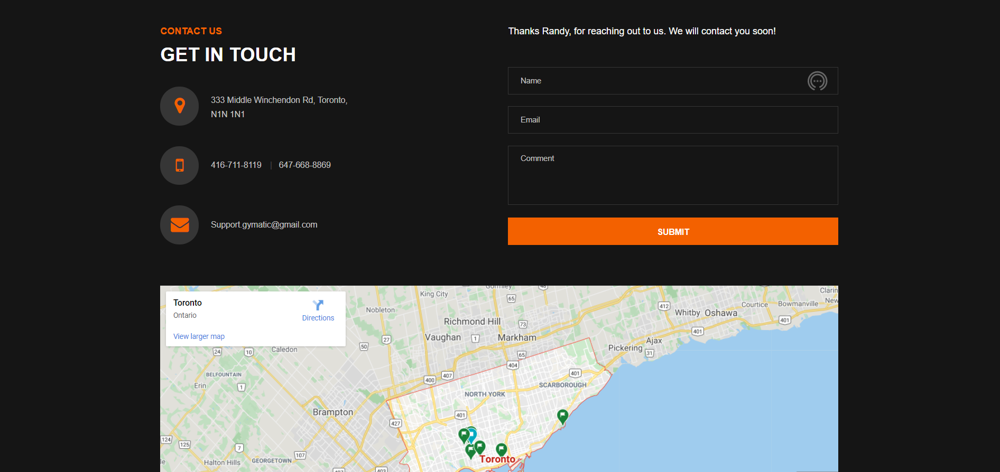

# GYMATIC
---

GYMATIC was created for a class project. Here I demonstrate what I have learned in Practical Python. 

## Practical Python Project Outline
3 pages at least
### Folders:
- Folder “templates” ➔ AT LEAST 3 html pages plus the template page (base.html) ➔ Total: 4
    HTML templates (files) inside the folder “templates”
- Folder “static” ➔ images, css, js, etc…
- Folder “data” ➔ Very simple JSON file to be called and displayed in any html page

### Required Files/Code:
1. One HTML page contains a form with at least 3 fields, when the form is submitted, you can
    either use the code in a or b:
    - (a)You can display the result (feedback) within the same contact us page (LMS outline).
    - (b)Or you can display the result in a separate page (like our in-class example “Flask-Intro”):
        - One page to display the form.
        - Another html page to process the form (Yes, you will have another html page).
2. One HTML page contains a data that are displayed from a JSON file.
3. Some images.

### Final Steps:
1. You will commit your code to GitHub as we have done before (using any repo name)
2. Deploy your project into Heroku website

## Languages/Frameworks used
- HTML5
- CSS3
- Bootstrap
- Python3
- Flask

## Deployment
Github pages doesn't really like flask designed sites.. So i used Heroku!

## User Stories
> John Smith 
> *As a pretty distracted person, I felt that this site was easy traverse.*

> Lind Rose 
> *I was really in need of a new gym to call home. The gym owner really put thought into their website, I had no issues getting the info needed! Thank you!* 

## Wireframes

## Acknowledgements
[Unplash](https://unsplash.com/) 
[Clipart](https://www.clipartkey.com/) 
[Google - for profile photos](https://www.google.ca/)

#### Live
[Gymatic](https://gymatic.herokuapp.com/)